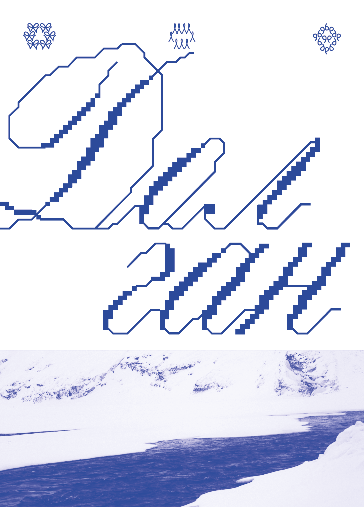
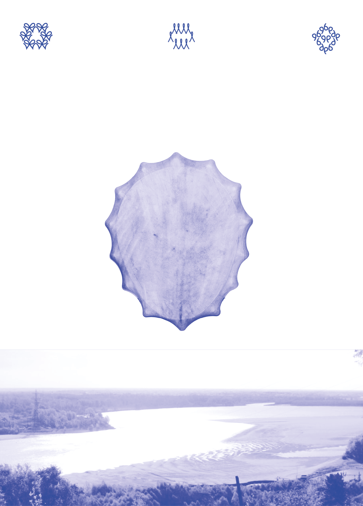
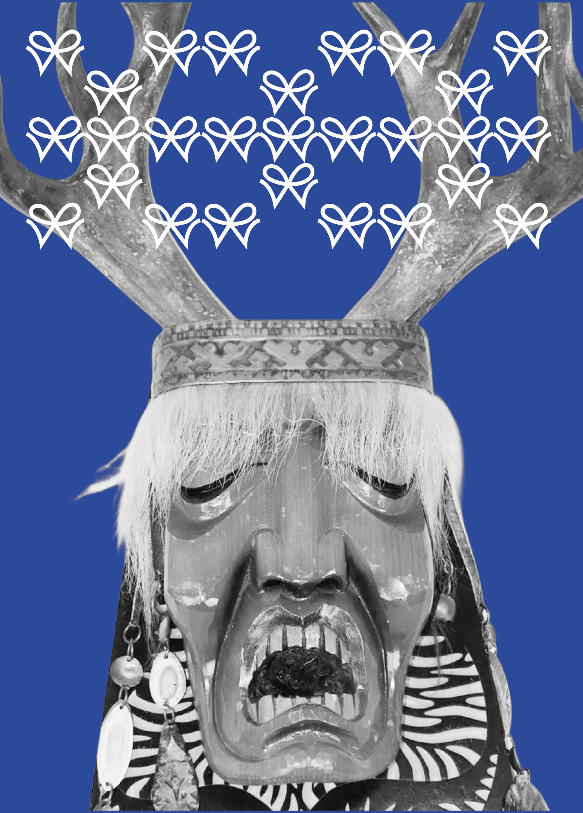
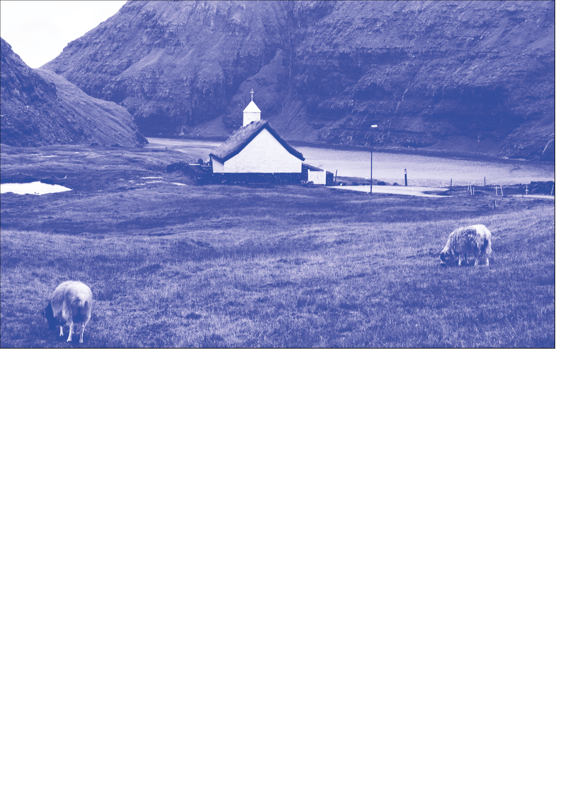
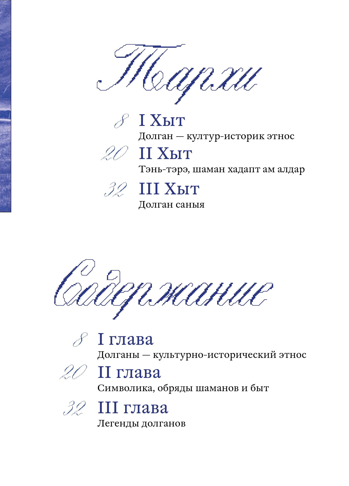
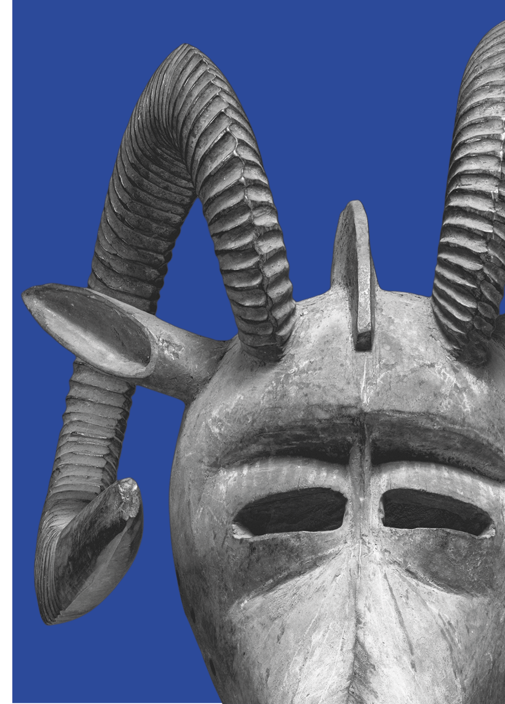
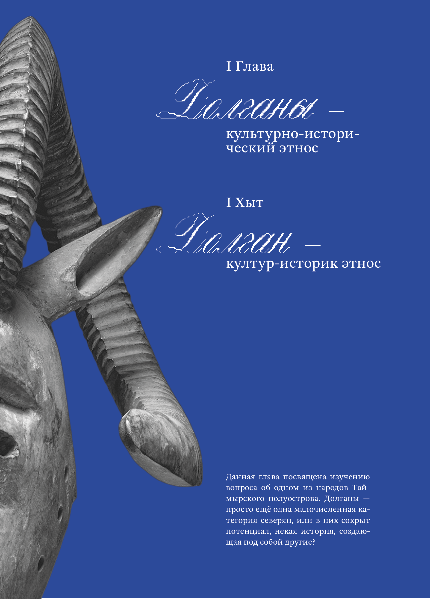
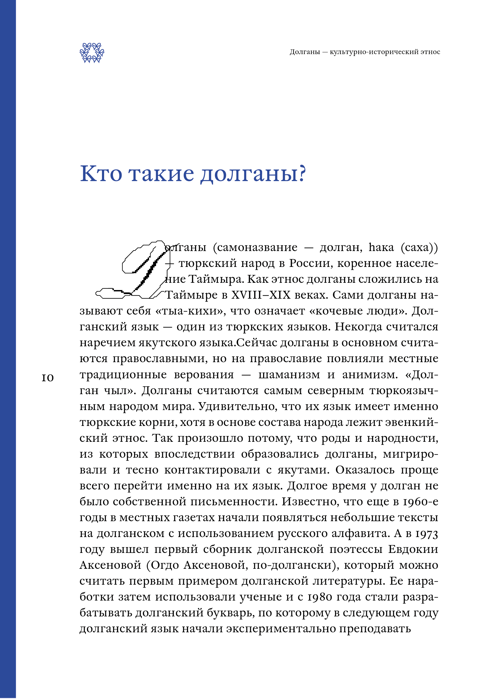
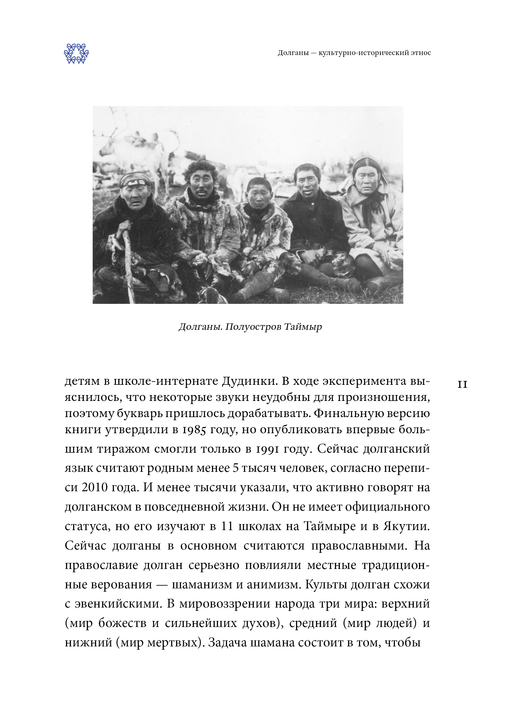

# baran_culture

4 module final project

Модели ИИ, с которыми я работала: Яндекс ИИ "Алиса"
Части кода, сделанные при помощи ИИ:

1. ИИ помог разобраться, как прописывать включение и выключение окон для всех кнопок отдельно по окну

// **\*\*\*\***\_**\*\*\*\***включение/выключение окон**\*\*\*\***\_**\*\*\*\***
windowButton()

//**\*\*\*\***\_\_**\*\*\*\***включение/выключение окон**\*\*\*\***\_\_**\*\*\*\***
function windowButton() {
document.addEventListener('DOMContentLoaded', function () {
let windowIcons = document.querySelectorAll('.window-icon')
let windows = document.querySelectorAll('[class^="window_"]')
let exitButtons = document.querySelectorAll('[class^="exit_"]')

    windowIcons.forEach((icon, index) => {
      icon.addEventListener('click', () => {
        let targetWindow = document.querySelector(`.window_${index + 1}`)
        if (targetWindow) {
          targetWindow.style.display = 'block'
        }
      })
    })

    exitButtons.forEach((button) => {
      button.addEventListener('click', function () {
        let windowToClose = this.closest('[class^="window_"]')
        if (windowToClose) {
          windowToClose.style.display = 'none'
        }
      })
    })

})
}

2. ИИ помог разобраться, как синхронизировать звук и ползунок громкости

// **\*\*\*\***\_\_\_\_**\*\*\*\***ползунок звука**\*\*\*\***\_\_\_\_**\*\*\*\***
volumeControl()

// **\*\*\*\***\_\_\_\_**\*\*\*\***ползунок звука**\*\*\*\***\_\_\_\_**\*\*\*\***
function volumeControl() {
let video = document.querySelector('.dolgan')
let volumeControl = document.getElementById('volumeControl')

if (video && volumeControl) {
volumeControl.addEventListener('input', (e) => {
let value = parseFloat(e.target.value)
video.volume = value

      if (value === 0) {
        video.muted = true
      } else {
        video.muted = false
      }
    })

    video.addEventListener('volumechange', () => {
      if (!video.muted) {
        volumeControl.value = video.volume
      } else {
        volumeControl.value = 0
      }
    })

}
}

3. ИИ помог разобраться, как положить изображения с разными подписями поверх окна с "проектами"

// \***\*\_\_\_\*\***выпадающее окно с изображением и надписью\***\*\_\_\_\*\***
modalWindowImg()

function modalWindowImg() {
document.addEventListener('DOMContentLoaded', modalWindowImg)
let thumbnails = document.querySelectorAll('[class^="imgInfo_"]')
let modal = document.querySelector('.modalImgWindow_1')
let modalImg = document.getElementById('modalImageSrc')
let captionP = document.getElementById('currentCaption')

modal.addEventListener('click', (e) => {
modal.style.display = 'none'
})

thumbnails.forEach((thumbnail) => {
thumbnail.addEventListener('click', (e) => {
e.preventDefault()
if (!modal || !modalImg || !captionP) return

      modal.style.display = 'block'

      modalImg.src = thumbnail.src

      let captionText = thumbnail.getAttribute('data-caption')
      captionP.textContent = captionText || ''

      let captionContainer = captionP.parentElement
      if (captionContainer) {
        captionContainer.style.display = captionText ? 'block' : 'none'
      }
    })

})
}

4. ИИ помог разобраться, как заставить несколько изображений появляться по ховеру на кнопку с содержимым

// **\*\***\_**\*\***картинки по ховеру**\*\***\_**\*\***
hoverImage1()

// **\*\***\_**\*\***картинки по ховеру**\*\***\_**\*\***
function hoverImage1() {
document.addEventListener('DOMContentLoaded', function () {
let hoverScreen = document.querySelector('.hoverScreen_1')
let windowNames = document.querySelectorAll('#windowName_7')
let images = hoverScreen.querySelectorAll('.windowContent1')
let currentImageIndex = 0
let animationInterval

    function showNextImage() {
      images.forEach((img) => {
        img.style.opacity = '0'
      })
      images[currentImageIndex].style.opacity = '1'
      currentImageIndex = (currentImageIndex + 1) % images.length
    }

    function startAnimation() {
      animationInterval = setInterval(showNextImage, 400)
    }

    function stopAnimation() {
      clearInterval(animationInterval)
      images.forEach((img) => {
        img.style.opacity = '0'
      })
    }

    windowNames.forEach((name) => {
      name.addEventListener('mouseenter', startAnimation)
      name.addEventListener('mouseleave', stopAnimation)
    })

})
}

5. ИИ помог разобраться, как по клику мышкой или пальцем в адаптированной версии сайта добавлять изображения на главный экран

// **\*\***\_\_**\*\***изображения по движению пальца**\*\***\_\_**\*\***
imageElementMobile()

// **\*\***\_\_**\*\***изображения по движению пальца**\*\***\_\_**\*\***
function imageElementMobile() {
let mainScreen = document.querySelector('.mainScreen')

// Если главного экрана нет, выходим, чтобы не было ошибок
if (!mainScreen) return

let images = [
'images/work1.png',
'images/work2.png',
'images/work3.png',
'images/work4.png',
'images/work5.png',
'images/work6.png',
'images/work7.png',
'images/work8.png',
'images/work9.png',
'images/work10.png'
]

document.addEventListener('mousemove', (event) => {
let x = event.clientX
let y = event.clientY

    let rect = mainScreen.getBoundingClientRect()

    let posX = x - rect.left
    let posY = y - rect.top

    let randomImage = images[Math.floor(Math.random() * images.length)]

    let img = document.createElement('img')
    img.src = randomImage
    img.className = 'imageElement'

    img.style.left = posX + 'px'
    img.style.top = posY + 'px'

    mainScreen.appendChild(img)

    setTimeout(() => {
      img.remove()
    }, 3000)

})
}

6. ИИ помог разобраться, как сворачивать окна с информацией в мобильном адаптиве

// сворачивание окон
collapseWindowMobile()

// сворачивание окон
function collapseWindowMobile() {
document.addEventListener('DOMContentLoaded', () => {
let buttons = document.querySelectorAll('.screenButton_about')

    buttons.forEach((btn) => {
      btn.addEventListener('click', () => {
        let parent = btn.parentElement
        while (parent && !parent.matches('[class*="windowScreen_"]')) {
          parent = parent.parentElement
        }
        if (!parent) return

        let wasCollapsed = parent.classList.toggle('windowScreen_collapsed')

        btn.textContent = wasCollapsed = '-'
      })
    })

})
}

7. Сайт freefronted.com помог встроить часть книги в страницу "архив"

html

                  

                    

                      <input type="radio" name="page" id="page-1" checked />
                      <input type="radio" name="page" id="page-2" />
                      <input type="radio" name="page" id="page-2-back" />
                      <input type="radio" name="page" id="page-3" />
                      <input type="radio" name="page" id="page-3-back" />
                      <input type="radio" name="page" id="page-4" />
                      <input type="radio" name="page" id="page-4-back" />
                      <input type="radio" name="page" id="page-5" />
                      <input type="radio" name="page" id="page-5-back" />
                      <input type="radio" name="page" id="page-6" />
                      <input type="radio" name="page" id="page-6-back" />

                      <label for="page-1" class="book__page book__page--1">
                        
                      </label>

                      

                        
                      

                      

                        <label for="page-2" class="book__page-front">
                          
                        </label>
                        <label for="page-1" class="book__page-back">
                          
                        </label>
                      

                      

                        <label for="page-3" class="book__page-front">
                          
                        </label>
                        <label for="page-2-back" class="book__page-back">
                          
                        </label>
                      

                      

                        <label for="page-4" class="book__page-front">
                          
                        </label>
                        <label for="page-3-back" class="book__page-back">
                          
                        </label>
                      

                      

                        <label for="page-5" class="book__page-front">
                          
                        </label>
                        <label for="page-4-back" class="book__page-back">
                          
                        </label>
                      

                      

                        <label for="page-6" class="book__page-front">
                          
                        </label>
                        <label for="page-5-back" class="book__page-back">
                          
                        </label>
                      

                      

                        <label for="page-7" class="book__page-front">
                          
                        </label>
                        <label for="page-6-back" class="book__page-back">
                          
                        </label>
                      

                    

                  

                

css
/_ ****\*\*****\_\_****\*\*****КНИГА****\*\*****\_\_****\*\***** _/
.flipbook-section {
width: 40vw;
height: 30vw;
display: flex;
flex-direction: column;
justify-content: center;
align-items: center;
background: #fff;
}

.cover {
width: 40vw;
aspect-ratio: 60 / 42.6; /_ preserves the original 720:511 proportions _/
height: 30vw;
box-shadow: 0 0 100px rgba(0, 0, 0, 0.3);
}

.book {
width: 100%;
height: 100%;
display: flex;
perspective: 1200px;
position: relative;
}

.book\_\_page {
position: relative;
width: 50%;
height: 100%;
display: grid;
transform: rotateY(0deg);
transition: transform 0.9s cubic-bezier(0.645, 0.045, 0.355, 1);
transform-origin: 0% 0%;
background-color: #f5f5f5;
background-image: linear-gradient(
90deg,
rgba(227, 227, 227, 1) 0%,
rgba(247, 247, 247, 0) 18%
);
}

.book\_\_page:nth-of-type(1) {
background-image: linear-gradient(
-90deg,
rgba(227, 227, 227, 1) 0%,
rgba(247, 247, 247, 0) 18%
);
}

.book\_\_page--1 {
overflow: hidden;
}

.book\_\_page--2 {
position: absolute;
right: 0;
transform-style: preserve-3d;
background-color: #f5f5f5;
background-image: linear-gradient(
90deg,
rgba(227, 227, 227, 1) 0%,
rgba(247, 247, 247, 0) 18%
);
}

.book\_\_page--4 {
cursor: pointer;
}

.book\_\_page--last {
position: absolute;
right: 0;
z-index: 0;
}

.book\_\_page--sheet-1 {
z-index: 4;
}

.book\_\_page--sheet-2 {
z-index: 3;
}

.book\_\_page--sheet-3 {
z-index: 2;
}

.book\_\_page--sheet-4 {
z-index: 1;
}

.book\_\_page-front {
position: absolute;
width: 100%;
height: 100%;
transform: rotateY(0deg) translateZ(1px);
overflow: hidden;
cursor: pointer;
backface-visibility: hidden;
}

.book\_\_page-back {
position: absolute;
width: 100%;
height: 100%;
transform: rotateY(180deg) translateZ(1px);
overflow: hidden;
cursor: pointer;
backface-visibility: hidden;
}

.book**page img,
.book**page-front img,
.book\_\_page-back img {
width: 100%;
max-width: 100%;
height: 100%;
object-fit: cover;
display: block;
}

.book input[type='radio'] {
display: none;
}

#page-2:checked ~ .book**page--sheet-1,
#page-2-back:checked ~ .book**page--sheet-1,
#page-3:checked ~ .book**page--sheet-1,
#page-3-back:checked ~ .book**page--sheet-1,
#page-4:checked ~ .book**page--sheet-1,
#page-4-back:checked ~ .book**page--sheet-1,
#page-5:checked ~ .book**page--sheet-1,
#page-3:checked ~ .book**page--sheet-2,
#page-3-back:checked ~ .book**page--sheet-2,
#page-4:checked ~ .book**page--sheet-2,
#page-4-back:checked ~ .book**page--sheet-2,
#page-5:checked ~ .book**page--sheet-2,
#page-4:checked ~ .book**page--sheet-3,
#page-4-back:checked ~ .book**page--sheet-3,
#page-5:checked ~ .book**page--sheet-3,
#page-5:checked ~ .book**page--sheet-4 {
transition: transform 0.9s cubic-bezier(0.645, 0.045, 0.355, 1);
transform: rotateY(-180deg);
}

#page-2:checked ~ .book\_\_page--sheet-1 {
z-index: 5;
}

#page-2-back:checked ~ .book\_\_page--sheet-1 {
z-index: 4;
}

#page-2-back:checked ~ .book\_\_page--sheet-2 {
z-index: 5;
}

#page-3:checked ~ .book\_\_page--sheet-1 {
z-index: 1;
}

#page-3:checked ~ .book\_\_page--sheet-2 {
z-index: 5;
}

#page-3-back:checked ~ .book\_\_page--sheet-1 {
z-index: 1;
}

#page-3-back:checked ~ .book\_\_page--sheet-2 {
z-index: 4;
}

#page-3-back:checked ~ .book\_\_page--sheet-3 {
z-index: 5;
}

#page-4:checked ~ .book\_\_page--sheet-1 {
z-index: 1;
}

#page-4:checked ~ .book\_\_page--sheet-2 {
z-index: 2;
}

#page-4:checked ~ .book\_\_page--sheet-3 {
z-index: 5;
}

#page-4-back:checked ~ .book\_\_page--sheet-1 {
z-index: 1;
}

#page-4-back:checked ~ .book\_\_page--sheet-2 {
z-index: 2;
}

#page-4-back:checked ~ .book\_\_page--sheet-3 {
z-index: 3;
}

#page-4-back:checked ~ .book\_\_page--sheet-4 {
z-index: 5;
}

#page-5:checked ~ .book\_\_page--sheet-1 {
z-index: 1;
}

#page-5:checked ~ .book\_\_page--sheet-2 {
z-index: 2;
}

#page-5:checked ~ .book\_\_page--sheet-3 {
z-index: 3;
}

#page-5:checked ~ .book\_\_page--sheet-4 {
z-index: 5;
}
